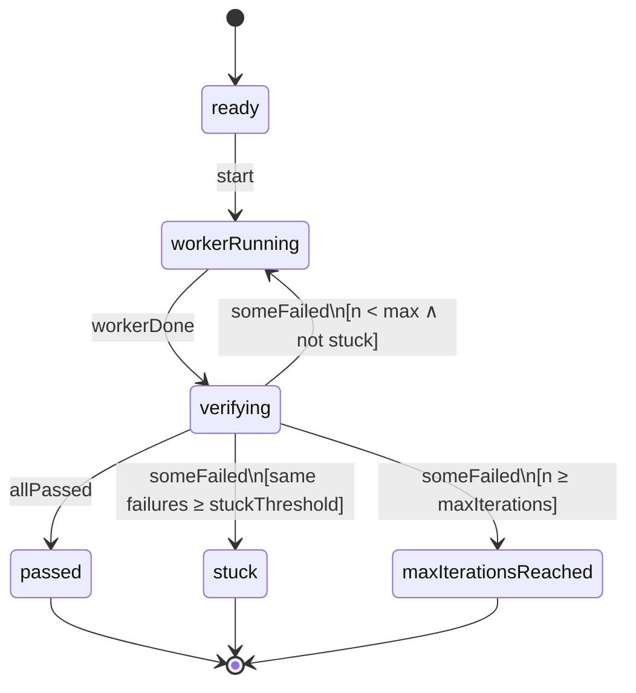
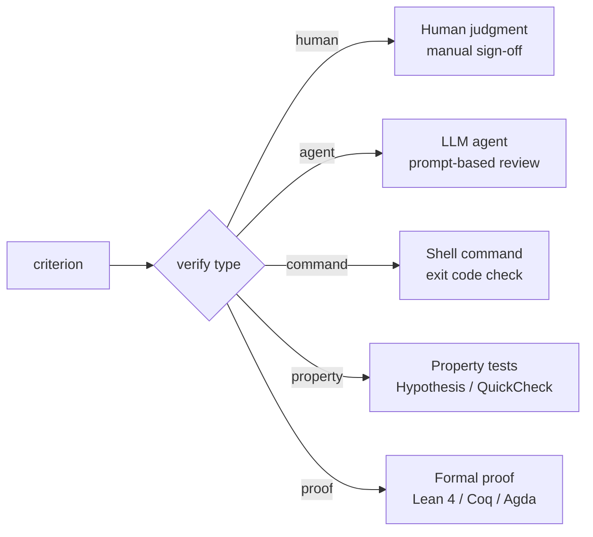

# Architecture

> How qed works internally — execution modes, the state machine, and verification dispatch.

## Overview

qed has two execution modes, determined by the `SpecMode` type:

### Worker loop (`SpecMode.workerLoop`)

When a spec has a `worker`, qed runs an iterative loop:

1. Dispatches the **worker** (any shell command — an AI agent, a build script, etc.)
2. **Verifies** each criterion using its typed strategy
3. **Loops** until all criteria pass, or terminates (stuck, max iterations, escalation)

The orchestrator is a **deterministic state machine**. LLMs are tools used *by* the orchestrator (as workers and reviewers), never the control plane.

### Verify (`SpecMode.verify`)

When a spec has no `worker`, qed runs each criterion once and reports results. No loop, no state machine — just a `List AcceptanceCriterion → List VerificationResult` function. Used for CI checks and standalone verification. Requires at least one criterion.

## State machine (worker loop)

The worker loop is driven by a pure transition function with no IO:

```lean
def transition (config : LoopConfig) (state : LoopState) (context : LoopContext)
    (event : LoopEvent) : LoopState × LoopContext
```

Worker loop proofs (termination, stuck detection, transition correctness) reason about this function. IO (process spawning, file reading) lives in the outer shell.

### State diagram



### Events

| Event | Description |
|-------|-------------|
| `workerDone` | Worker has completed its run |
| `allPassed` | All auto-verifiable criteria passed |
| `someFailed` | Some criteria failed (carries the failing descriptions) |

### Terminal states

Terminal states are **absorbing** — once reached, all events are ignored. This is formally proven in `Qed/Proofs/FinalStates.lean`.

| State | Meaning |
|-------|---------|
| `passed` | All criteria satisfied |
| `stuck` | Same failures repeated for `stuckThreshold` consecutive iterations |
| `maxIterationsReached` | Hit the iteration cap |
| `escalated` | Reserved for future human-in-the-loop escalation |

### Stuck detection

The loop tracks consecutive identical failures via `LoopContext`:

```lean
structure LoopContext where
  consecutiveFailureCount : Nat
  previousFailures : List String
```

On each `someFailed` event, the transition function compares the current failures to the previous ones. If they match, the consecutive count increments. If they differ, it resets to 1. When the count reaches `stuckThreshold`, the loop enters `stuck`.

This prevents infinite retry loops where the worker keeps producing the same broken output.

## Verification dispatch

Each acceptance criterion has a typed verification strategy:



The verification type determines both **what runs** and **what guarantee you get**:

| Type | Runs | Guarantee | CI default |
|------|------|-----------|------------|
| `human` | Nothing (waits) | Human judgment | `manual` |
| `agent` | LLM agent (any backend) | Probabilistic | `always` |
| `command` | Shell command | Deterministic | `always` |
| `property` | Test framework | Statistical | `always` |
| `proof` | Proof checker | Mathematical | `always` |

## Spec loading

Specs are files in the repo — version-controlled, schema-validated, colocated with the code they specify. `SpecLoader` reads and lists spec files from disk:

```lean
def loadSpec (path : System.FilePath) : IO (Except String Spec)
def listSpecs (directory : System.FilePath) (extension : String) : IO (Except String (List System.FilePath))
def listAllSpecs (directory : System.FilePath) : IO (Except String (List System.FilePath))  -- recursive
```

`listAllSpecs` recursively searches for `.spec.json` and `.spec.toml` files, skipping hidden directories and build artifacts. `qed verify` with no argument defaults to the current directory.

## Pure core, IO shell

The architecture follows a strict separation:

| Layer | IO? | What lives here |
|-------|-----|-----------------|
| **Pure core** | No | Types, StateMachine, Parser, TomlParser, TomlConverter, Output, Serializer, Proofs |
| **IO shell** | Yes | WorkerLoop, Verifier, SpecLoader, CLI |

The pure core is where all proofs live. It has no side effects, no process spawning, no file access. The IO shell wraps the pure core with real-world effects — parsing files, running commands, reporting results.

This separation means proofs about the state machine are proofs about the actual system behavior, not about a model of it.

## Configuration

All meaningful parameters are configurable at the spec level — defaults are sensible but overridable:

| Parameter | Default | Where set |
|-----------|---------|-----------|
| `maxIterations` | 10 | Spec file (worker loop) |
| `stuckThreshold` | 3 | Spec file (worker loop) |
| `timeout` (worker) | 3600s | Spec file (`[worker]`) |
| `timeout` (command) | 300s | Spec file (`[[criteria]]`) |
| `timeout` (property) | 600s | Spec file (`[[criteria]]`) |
| `model` (agent) | `claude-opus-4-6` | Spec file (`[[criteria]]`) |
| `workdir` | `.` | Spec file (`[worker]`) |

Environment variables consumed by qed:

| Variable | Purpose |
|----------|---------|
| `TMPDIR` | Temp directory for failure files (falls back to `/tmp`) |

Environment variables set by qed for workers:

| Variable | Purpose |
|----------|---------|
| `QED_PROMPT` | Full prompt with failure feedback (Tier 1 only) |
| `QED_ITERATION` | Current iteration number |
| `QED_FAILURES_FILE` | Path to JSON file with failure details |

Environment variables set by qed for agent verification:

| Variable | Purpose |
|----------|---------|
| `QED_AGENT_PROMPT` | The criterion's review prompt |
| `QED_AGENT_SYSTEM_PROMPT` | Verdict format instructions (JSON block with `{"pass": true/false}`) |

CLI flags:

| Flag | Purpose |
|------|---------|
| `--json` | Machine-readable JSON output (position-independent) |

Exit codes:

| Code | Meaning |
|------|---------|
| 0 | Success — all criteria passed |
| 1 | Verification failure — one or more criteria failed |
| 2 | Configuration or usage error — bad spec, missing file, unknown command |

Named constants in the IO shell (not configurable — reasonable defaults):

| Constant | Value | Location |
|----------|-------|----------|
| `maxOutputLength` | 2000 chars | `Verifier.lean` — output truncation (keeps tail) |
| `stderrPreviewLength` | 200 chars | `WorkerLoop.lean` — stderr preview in terminal |

## Spec format

Two serialization formats, same types:

- **JSON** (`.spec.json`) — simple specs, parsed via `Lean.Json`
- **TOML** (`.spec.toml`) — multi-line strings (agent prompts, human instructions)

Both validate against the same [JSON Schema](spec.schema.json). See [spec-format.md](spec-format.md) for the full reference.
