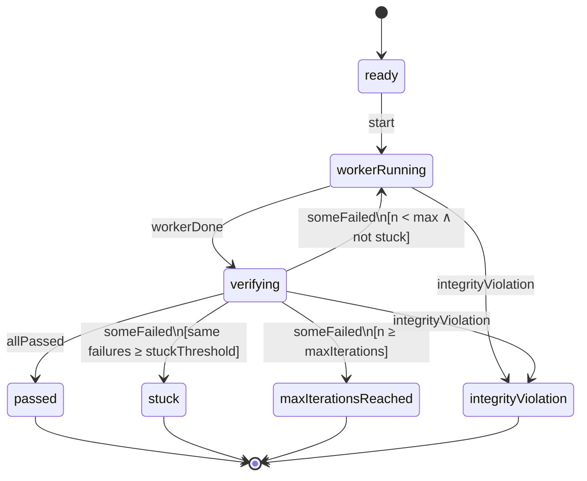
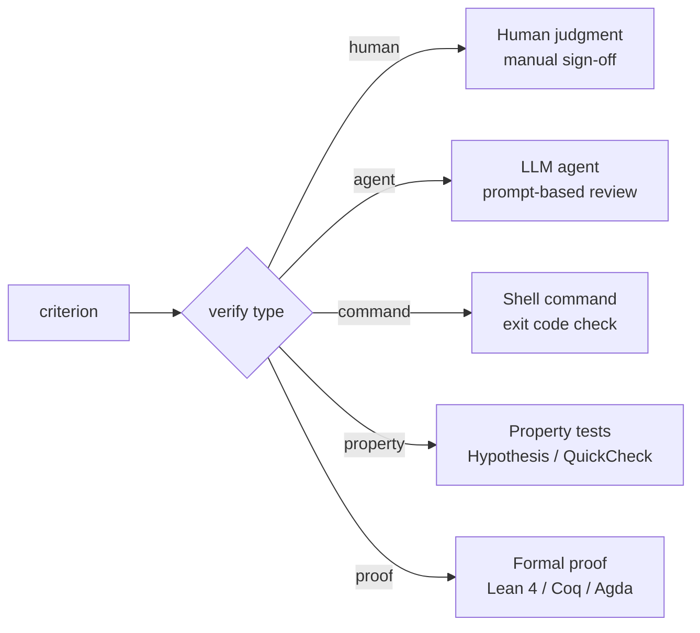

# Architecture

> How qed works internally — execution modes, the state machine, and verification dispatch.

## Overview

qed has two execution modes, determined by the `SpecMode` type:

### Worker loop (`SpecMode.workerLoop`)

When a spec has a `worker`, qed runs an iterative loop:

1. Dispatches the **worker** (any shell command — an AI agent, a build script, etc.)
2. **Verifies** each criterion using its typed strategy
3. **Loops** until all criteria pass, or terminates (stuck, max iterations, escalation)

The orchestrator is a **deterministic state machine**. LLMs are tools used _by_ the orchestrator (as workers and reviewers), never the control plane.

### Verify (`SpecMode.verify`)

When a spec has no `worker`, qed runs each criterion once and reports results. No loop, no state machine — just a `List AcceptanceCriterion → List VerificationResult` function. Used for CI checks and standalone verification. Requires at least one criterion.

## State machine (worker loop)

The worker loop is driven by a pure transition function with no IO:

```lean
def transition (config : LoopConfig) (state : LoopState) (context : LoopContext)
    (event : LoopEvent) : LoopState × LoopContext
```

Worker loop proofs (termination, stuck detection, transition correctness) reason about this function. IO (process spawning, file reading) lives in the outer shell.

### State diagram



### Events

| Event                | Description                                             |
| -------------------- | ------------------------------------------------------- |
| `workerDone`         | Worker has completed its run                            |
| `allPassed`          | All auto-verifiable criteria passed                     |
| `someFailed`         | Some criteria failed (carries the failing descriptions) |
| `integrityViolation` | Spec file was modified during execution                 |

### Terminal states

Terminal states are **absorbing** — once reached, all events are ignored. This is formally proven in `Qed/Proofs/FinalStates.lean`.

| State                  | Meaning                                                            |
| ---------------------- | ------------------------------------------------------------------ |
| `passed`               | All criteria satisfied                                             |
| `stuck`                | Same failures repeated for `stuckThreshold` consecutive iterations |
| `maxIterationsReached` | Hit the iteration cap                                              |
| `escalated`            | Reserved for future human-in-the-loop escalation                   |
| `integrityViolation`   | Spec file was modified during execution — results rejected         |

### Stuck detection

The loop tracks consecutive identical failures via `LoopContext`:

```lean
structure LoopContext where
  consecutiveFailureCount : Nat
  previousFailures : List String
```

On each `someFailed` event, the transition function compares the current failures to the previous ones. If they match, the consecutive count increments. If they differ, it resets to 1. When the count reaches `stuckThreshold`, the loop enters `stuck`.

This prevents infinite retry loops where the worker keeps producing the same broken output.

## Verification dispatch

Each acceptance criterion has a typed verification strategy:



The verification type determines both **what runs** and **what guarantee you get**:

| Type       | Runs                    | Guarantee      | CI default |
| ---------- | ----------------------- | -------------- | ---------- |
| `human`    | Nothing (waits)         | Human judgment | `manual`   |
| `agent`    | LLM agent (any backend) | Probabilistic  | `always`   |
| `command`  | Shell command           | Deterministic  | `always`   |
| `property` | Test framework          | Statistical    | `always`   |
| `proof`    | Proof checker           | Mathematical   | `always`   |

## Spec loading

Specs are files in the repo — version-controlled, schema-validated, colocated with the code they specify. `SpecLoader` reads and lists spec files from disk:

```lean
def loadSpec (path : System.FilePath) : IO (Except String Spec.Pinned)
def listSpecs (directory : System.FilePath) (extension : String) : IO (Except String (List System.FilePath))
def listAllSpecs (directory : System.FilePath) : IO (Except String (List System.FilePath))  -- recursive
```

`loadSpec` returns a `Spec.Pinned` — the parsed spec plus the file path and SHA-256 hash of the raw file bytes at load time. This hash is used for integrity verification throughout execution.

`listAllSpecs` recursively searches for `.spec.json` and `.spec.toml` files, skipping hidden directories and build artifacts. `qed verify` with no argument defaults to the current directory.

## Pure core, IO shell

The architecture follows a strict separation:

| Layer         | IO? | What lives here                                                                           |
| ------------- | --- | ----------------------------------------------------------------------------------------- |
| **Pure core** | No  | Types, Agent, StateMachine, Parser, TomlParser, TomlConverter, Output, Serializer, Proofs |
| **IO shell**  | Yes | Shell, Integrity, WorkerLoop, Verifier, SpecLoader, CLI                                   |

The pure core is where all proofs live. It has no side effects, no process spawning, no file access. The IO shell wraps the pure core with real-world effects — parsing files, running commands, reporting results.

This separation means proofs about the state machine are proofs about the actual system behavior, not about a model of it.

## Spec integrity

qed content-addresses spec files to detect tampering during execution. At load time, the raw file bytes are hashed (SHA-256) and stored in `Spec.Pinned`. Integrity is verified at three points per worker loop iteration:

1. **Before worker spawn** — catches tampering between iterations
2. **Before verification** — catches worker tampering
3. **After verification** — catches verifier tampering

If the hash doesn't match, a `LoopEvent.integrityViolation` transitions the state machine to a terminal `integrityViolation` state. Formally proven: this event always produces a terminal state (no results accepted).

The `--pin` flag adds a `git diff --exit-code` check — the spec must match its committed version. This answers a stronger question: not just "the spec didn't change during this run" but "the spec matches what's in version control."

## Further reading

- [CLI reference](cli-reference.md) — commands, flags, exit codes, environment variables, configuration
- [Spec format](spec-format.md) — complete field-by-field reference for spec files
- [Proven properties](proven-properties.md) — all 40+ formally verified theorems
